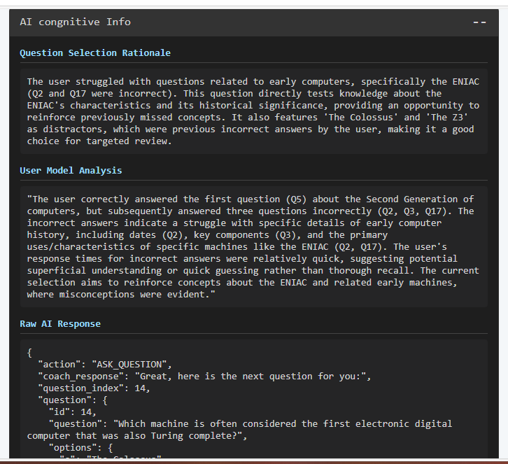

# 🧠 CogniTrain: AI-Powered MCQ Practice Coach

CogniTrain is an intelligent, interactive web application designed to help users practice for exams and improve their knowledge retention through adaptive multiple-choice questions (MCQs) and personalized feedback.

---

## 📚 About the Project

This project is an advanced educational tool that leverages a powerful AI backend (Google's Gemini) to create a dynamic and responsive learning experience. Unlike static quiz applications, CogniTrain analyzes user performance in real-time to select questions that target individual strengths and weaknesses, applying principles of spaced repetition to maximize learning efficiency.

The application's architecture follows a "Pure LLM-Cognition" model, where the Flask backend acts as a simple data marshaller, delegating all cognitive tasks—such as question selection, performance analysis, and feedback generation—to the Gemini language model.

---

## ✨ Features

- **🤖 AI-Powered Question Selection:** The app uses an AI model to intelligently select the next question based on the user's historical performance, focusing on areas that need improvement.
- **🔄 Adaptive Learning:** Implements a spaced repetition strategy to reinforce learning and improve long-term retention.
- **✅ Instant & Insightful Feedback:** Provides immediate feedback on answers, including detailed explanations for the correct choice.
- **💬 Conversational Interface:** A user-friendly chat interface allows for natural interaction.
- **🧠 Real-time Performance Analysis:** The AI analyzes response times and correctness to build a dynamic model of the user's learning curve.
- **🔧 Developer Insights:** Includes a built-in development panel to display the AI's reasoning, including question selection rationale and student model analysis.

---

## 📸 Screenshots

| Initial Welcome | First Question | Correct Answer |
| :---: | :---: | :---: |
|  |  |  |

| Incorrect Answer with Hint | About Section | AI Cognitive Info Panel |
| :---: | :---: | :---: |
|  |  |  |


---

## 🚀 Getting Started

### Prerequisites

- Python 3.8+
- `pip`
- A Google Gemini API Key

### Installation

1.  **Clone the repository:**
    ```bash
    git clone https://github.com/YOUR_USERNAME/CogniTrain.git
    cd CogniTrain
    ```

2.  **Install dependencies:**
    ```bash
    pip install -r requirements.txt
    ```

3.  **Set up your environment variables:**
    Create a `.env` file in the root of the project and add your Gemini API key:
    ```
    GEMINI_API_KEY="YOUR_API_KEY"
    ```
    The application uses `python-dotenv` to automatically load this key.

4.  **Run the application:**
    ```bash
    python src/app.py
    ```

5.  **Open your browser** and navigate to:
    ```
    http://127.0.0.1:5000/
    ```

---

## 🗂️ Project Structure

```
CogniTrain/
├── assets/
│   ├── About_Section.png
│   ├── AI_Cognitive_Info_Panel.png
│   ├── Correct_Answer.png
│   ├── First_Question.png
│   ├── Incorrect_Answer_with_Hint1.png
│   ├── Incorrect_Answer_with_Hint2.png
│   └── Initial_Welcome.png
├── src/
│   ├── app.py                # Main Flask application (data marshaller)
│   ├── gemini_service.py     # Wrapper for Google Gemini API interaction
│   ├── prompts.py            # Contains the master prompt for the LLM
│   ├── question_bank.py      # Loads questions from the JSON file
│   ├── mcq.json              # Default question bank
│   └── mcq2.json
├── static/
│   ├── AI.jpg
│   ├── script.js             # Frontend logic for the chat interface
│   └── style.css             # Styling for the application
├── templates/
│   └── index.html            # Main HTML page for the chat interface
├── .gitignore
├── LICENSE
├── README.md                 # This file
├── requirements.txt          # Python dependencies
```

---

## 💡 Future Improvements

- **User Authentication:** Add user accounts to track progress across sessions.
- **Expanded Question Banks:** Allow users to choose from different topics or upload their own question sets.
- **Enhanced UI/UX:** Incorporate a modern frontend framework like React or Vue.js for a more dynamic user experience.
- **Advanced Analytics:** Provide users with a dashboard to visualize their performance and learning progress over time.

---

## 👨‍💻 Author

**Aniket Sarkar**

---

## 📄 License

This project is open-source and available under the [MIT License](LICENSE).